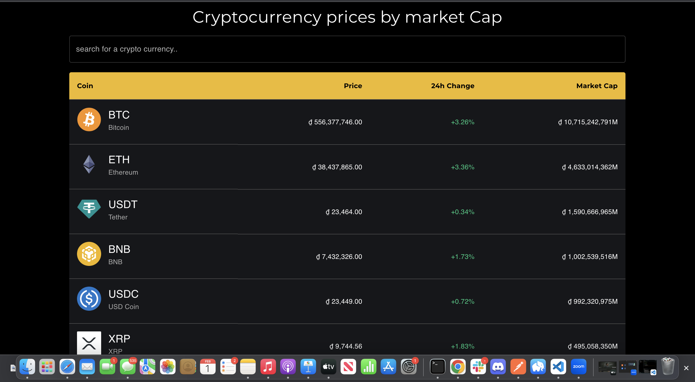
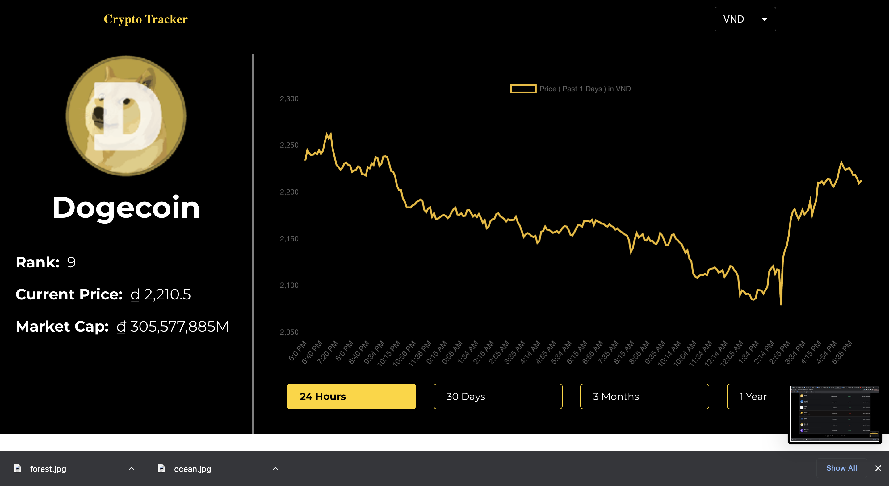

# Cryptocurrency Tracker 

This project is about the list of multiple cryptocurrencies, so user can easily keep track on the value daily

## Interfaces

## Technologies Used
- [React JS](https://reactjs.org/)
- [Material UI](https://v4.mui.com/)
- [Chart JS](https://reactchartjs.github.io/react-chartjs-2/#/)

## Live link

[https://crypto-watchlist-react.netlify.app/](https://crypto-watchlist-react.netlify.app/)

